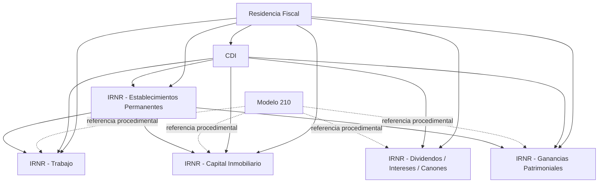

# IRNR Domain v1 Certification

Fecha: 2026-07-19
Estado: Certificacion oficial
Alcance: EPIC-KF-008 - STORY-KF-011

## 1. Resumen ejecutivo

`IRNR Domain v1` queda certificado como un dominio doctrinal material completo,
coherente y estable sobre el contrato `@ag/knowledge-contract@1.0.0`, sin
cambios de arquitectura, sin cambios de contrato y sin deuda tecnica
bloqueante para abrir el siguiente dominio de conocimiento.

El dominio certificado incluye cinco `Knowledge Objects` materiales:

- `IRNR - Rendimientos del Trabajo`
- `IRNR - Rendimientos del Capital Inmobiliario`
- `IRNR - Dividendos, Intereses y Canones`
- `IRNR - Ganancias Patrimoniales`
- `IRNR - Establecimientos Permanentes`

Y se apoya de forma estructural en tres dependencias doctrinales o
procedimentales:

- `Residencia Fiscal en Espana`
- `Convenios para Evitar la Doble Imposicion (CDI)`
- `Modelo 210 - Imputacion de rentas inmobiliarias de no residentes`

La validacion conjunta confirma siete cosas:

1. los cinco objetos del dominio cumplen exactamente el contrato estructural;
2. las dependencias doctrinales se reutilizan correctamente, sin
   reimplementacion material innecesaria;
3. `Modelo 210` se usa como soporte procedimental donde procede y no se
   convierte en doctrina material del dominio;
4. todas las derivaciones `Planner`, `Web`, `AI`, `Checklist`, `FAQ` y
   `Client Response` validan sin contradicciones;
5. las relaciones entre objetos son consistentes y no presentan referencias
   rotas dentro del dominio certificado;
6. el dominio tiene cobertura suficiente para ser tratado como una unidad
   funcional estable;
7. la plataforma permanece intacta bajo `FEATURE FREEZE`.

Respuesta oficial:

> Si. IRNR Domain v1 puede considerarse estable y apto para cerrar el primer
> dominio doctrinal completo de fiscalidad material internacional antes de
> abrir el siguiente dominio.

## 2. Inventario oficial del dominio

| stableKey | Titulo | Version | Estado | Owner | Fecha certificacion tecnica | Dependencias doctrinales | Objetos consumidores / expansion principal | Relaciones |
| --- | --- | --- | --- | --- | --- | --- | --- | --- |
| `irnr-rendimientos-trabajo` | IRNR - Rendimientos del Trabajo | `1.0.0` | `validado` | `equipo-fiscal-internacional-personas-fisicas` | `2026-07-18T23:59:00Z` | Residencia Fiscal, CDI, referencia procedimental a Modelo 210 | Otras categorias IRNR, IRPF internacional, Modelo 151, teletrabajo internacional | 7 |
| `irnr-rendimientos-capital-inmobiliario` | IRNR - Rendimientos del Capital Inmobiliario | `1.0.0` | `validado` | `equipo-fiscal-no-residentes-internacional` | `2026-07-18T23:59:00Z` | Residencia Fiscal, CDI, referencia procedimental a Modelo 210 | IRNR - Rendimientos del Trabajo, IRPF internacional | 5 |
| `irnr-dividendos-intereses-canones` | IRNR - Dividendos, Intereses y Canones | `1.0.0` | `validado` | `equipo-fiscal-no-residentes-internacional` | `2026-07-18T23:59:00Z` | Residencia Fiscal, CDI, referencia procedimental a Modelo 210 | IRNR - Rendimientos del Trabajo, IRPF internacional | 5 |
| `irnr-ganancias-patrimoniales` | IRNR - Ganancias Patrimoniales | `1.0.0` | `validado` | `equipo-fiscal-no-residentes-internacional` | `2026-07-19T00:30:00Z` | Residencia Fiscal, CDI, referencia procedimental a Modelo 210 | IRNR - Rendimientos del Trabajo, IRPF internacional | 5 |
| `irnr-establecimientos-permanentes` | IRNR - Establecimientos Permanentes | `1.0.0` | `validado` | `equipo-fiscal-no-residentes-internacional` | `2026-07-19T23:59:00Z` | Residencia Fiscal, CDI | IRNR - Rendimientos del Trabajo, IRNR - Rendimientos del Capital Inmobiliario, IRNR - Ganancias Patrimoniales | 5 |

## 3. Dependencias doctrinales incluidas en la certificacion

| stableKey | Titulo | Rol dentro del dominio |
| --- | --- | --- |
| `residencia-fiscal-espana` | Residencia Fiscal en Espana | Objeto doctrinal raiz para determinar la condicion previa del contribuyente |
| `convenios-doble-imposicion-cdi` | Convenios para Evitar la Doble Imposicion (CDI) | Capa convencional para resolver conflictos internacionales y modular la potestad tributaria |
| `irnr-modelo-210-imputacion-rentas` | Modelo 210 - Imputacion de rentas inmobiliarias de no residentes | Dependencia procedimental reutilizada por parte del dominio IRNR sin absorber doctrina material general |

## 4. Matriz de dependencias doctrinales

### 4.1 Grafo principal del dominio



### 4.2 Lectura funcional

- `Residencia Fiscal` actua como puerta de entrada doctrinal del dominio.
- `CDI` funciona como capa metodologica transversal para conflictos
  internacionales.
- `Modelo 210` aparece como soporte procedimental referenciado por cuatro
  objetos materiales del dominio, pero no como objeto doctrinal troncal.
- `IRNR - Establecimientos Permanentes` no duplica `Modelo 210` porque su
  salida natural escala a `Modelo 200`, `Modelo 202` y `Modelo 206`.

### 4.3 Estado de las relaciones

- Relaciones internas del dominio: consistentes.
- Dependencias doctrinales explicitas: presentes en todos los objetos
  materiales del dominio.
- Referencias rotas dentro del dominio certificado: no detectadas.
- Ciclos innecesarios entre objetos certificados del dominio: no detectados.

## 5. Auditoria estructural

Resultado: `PASS`

Verificaciones confirmadas en los cinco objetos del dominio:

- `identity`: presente y estable.
- `governance`: version `1.0.0`, estado `validado`, owner definido.
- `classification`: presente y coherente con fiscalidad material `IRNR`.
- `channelPolicy`: consistente en raiz y alineada con el patron certificado de
  la biblioteca.
- `executiveSummary`: presente.
- bloques obligatorios: los cinco objetos contienen exactamente los nueve
  bloques tipados exigidos por el contrato actual.
- `relations`: presentes y sin desviaciones contractuales.
- `auditMetadata`: presente.

Evidencia estructural:

- los cinco objetos `IRNR` contienen `9` bloques;
- todos validan contra el schema publicado;
- `knowledge-object.generated.ts` sigue sincronizado con el schema.

## 6. Auditoria doctrinal

Resultado: `PASS`

### 6.1 Ausencia de duplicidades entre categorias de renta

No se detecta reimplementacion material innecesaria entre:

- `Trabajo`
- `Capital Inmobiliario`
- `Dividendos, Intereses y Canones`
- `Ganancias Patrimoniales`
- `Establecimientos Permanentes`

Cada objeto conserva su propia frontera doctrinal:

- `Trabajo` se centra en rendimientos laborales y teletrabajo internacional;
- `Capital Inmobiliario` en rentas inmobiliarias, deducibilidad y frontera con
  actividad economica;
- `Dividendos, Intereses y Canones` en calificacion, exenciones internas,
  convenio, retenciones y cierre operativo minimo;
- `Ganancias Patrimoniales` en inmuebles, acciones y participaciones,
  `no sujecion`, `exencion` y retencion inmobiliaria;
- `Establecimientos Permanentes` en lugar fijo, agentes, actividad preparatoria
  o auxiliar, convenio y escalado operativo general.

### 6.2 Reutilizacion de Residencia Fiscal

Los cinco objetos del dominio consumen la residencia como decision previa y no
reabsorben su doctrina de fondo.

### 6.3 Reutilizacion de CDI

Los cinco objetos del dominio consumen `CDI` como marco metodologico y de
reparto de potestad, sin rehacer la teoria general del convenio dentro de cada
objeto material.

### 6.4 Uso procedimental de Modelo 210

`Modelo 210` se utiliza correctamente como dependencia procedimental
referenciada en:

- `IRNR - Rendimientos del Trabajo`
- `IRNR - Rendimientos del Capital Inmobiliario`
- `IRNR - Dividendos, Intereses y Canones`
- `IRNR - Ganancias Patrimoniales`

`IRNR - Establecimientos Permanentes` no lo referencia porque su salida natural
ya no es la del modelo 210, sino la de los modelos societarios y de pagos
fraccionados propios del `EP`.

### 6.5 Separacion entre tributacion material y cumplimiento

La frontera se mantiene limpia:

- los objetos materiales resuelven el criterio doctrinal y operativo;
- `Modelo 210` queda como apoyo de cumplimiento cuando procede;
- `EP` escala fuera del carril de `Modelo 210` sin invadir contabilidad,
  atribucion de beneficios o precios de transferencia.

## 7. Auditoria editorial

Resultado: `PASS`

El dominio se percibe como un sistema doctrinal unico por:

- nomenclatura homogenea de objetos, derivaciones e informes;
- estructura repetible de bloques tipados;
- tono tecnico-operativo consistente;
- referencias cruzadas alineadas;
- separacion clara entre doctrina transversal, dependencia procedimental y
  objeto material.

Correccion editorial menor aplicada en esta historia:

1. normalizacion del listado del `README` para evitar la duplicidad de
   `IRNR - Establecimientos Permanentes` y fijar correctamente su posicion como
   septimo objeto del segundo ciclo.

No se han modificado:

- contrato;
- schema;
- tipos generados;
- Rule Engine;
- consumers;
- arquitectura.

## 8. Auditoria funcional

Resultado: `PASS`

Todos los objetos del dominio y sus dependencias validan simultaneamente en:

- `Schema Validation`
- `Rule Engine`
- `Planner View`
- `Web View`
- `AI Context`
- `Checklist`
- `FAQ`
- `Client Response`

No se detectan contradicciones entre vistas derivadas del mismo objeto.

### Evidencia consolidada

- `generate:check`: `PASS`
- `validate:example`: `PASS`
- `validate:story-kf-008a`: `PASS`
- `validate:story-kf-008b`: `PASS`
- `validate:story-kf-008d`: `PASS`
- `validate:story-kf-010a`: `PASS`
- `validate:story-kf-010b`: `PASS`
- `validate:story-kf-010c`: `PASS`
- `validate:story-kf-010d`: `PASS`
- `scripts/check.mjs`: `PASS`
- suite global: `129/129 PASS`

Nota de alcance tecnico:

- el paquete no define tareas independientes de `lint` ni `tsc --noEmit`;
  en este repositorio la garantia equivalente se apoya en la sincronizacion
  `schema -> generated types`, la compilacion estricta del schema con `Ajv`
  y la suite automatizada completa.

## 9. Cobertura funcional del dominio

### 9.1 Cubierto

- `IRNR - Rendimientos del Trabajo`
- `IRNR - Rendimientos del Capital Inmobiliario`
- `IRNR - Dividendos, Intereses y Canones`
- `IRNR - Ganancias Patrimoniales`
- `IRNR - Establecimientos Permanentes`

### 9.2 Pendiente

Pendientes legitimos no bloqueantes:

- objetos especializados futuros si el uso real los justifica;
- actualizaciones por cambios normativos futuros;
- capas mas granulares de `IRNR` fuera del dominio v1 ya certificado.

## 10. Versionado y compatibilidad

Resultado: `PASS`

- version del contrato: `@ag/knowledge-contract@1.0.0`
- version de todos los objetos certificados del dominio: `1.0.0`
- compatibilidad: uniforme
- historial de certificaciones previo:
  - `KNOWLEDGE_FACTORY_V1_CERTIFICATION_2026-07-18.md`
  - `KNOWLEDGE_LIBRARY_V2_CERTIFICATION.md`

No se detecta mezcla de versiones de contrato ni de objetos dentro del dominio
certificado.

## 11. Riesgos pendientes

Riesgos residuales no bloqueantes:

1. varias relaciones siguen apuntando de forma legitima a objetos futuros del
   roadmap; si no se gobiernan, podrian quedarse obsoletas en ciclos
   posteriores;
2. el dominio v1 cubre las categorias materiales nucleares de `IRNR`, pero no
   cierra aun dominios adyacentes como `IRPF Internacional`, `Movilidad
   Internacional`, `Patrimonio Internacional` o `Fiscalidad Internacional
   Empresarial`;
3. la referencia procedimental a `Modelo 210` debera seguir vigilada para que
   futuros objetos no la conviertan en doctrina material general del impuesto.

Ninguno de estos riesgos bloquea la certificacion del dominio.

## 12. Quality Gate

| Control | Estado |
| --- | --- |
| Cero cambios de arquitectura | PASS |
| Cero cambios del contrato | PASS |
| Cero cambios del schema | PASS |
| Cero cambios del Rule Engine | PASS |
| Relaciones doctrinales consistentes | PASS |
| Dominio funcionalmente completo para v1 | PASS |
| Deuda tecnica relevante bloqueante | NO |

## 13. Roadmap del siguiente dominio

Prioridad recomendada tras cerrar `IRNR Domain v1`:

1. `IRPF Internacional`
2. `Movilidad Internacional`
3. `Patrimonio Internacional`
4. `Fiscalidad Internacional Empresarial`

## 14. Veredicto

```text
STORY-KF-011

IRNR DOMAIN v1

Trabajo ........................ PASS
Capital Inmobiliario ........... PASS
Dividendos / Intereses / Canones PASS
Ganancias Patrimoniales ........ PASS
Establecimientos Permanentes ... PASS

Structural Audit ............... PASS
Doctrinal Audit ................ PASS
Editorial Audit ................ PASS
Functional Audit ............... PASS
Relations Audit ................ PASS
Coverage Matrix ............... PASS
Quality Gate ................... PASS

Architecture Changes ........... NO

STATUS

IRNR DOMAIN v1 CERTIFIED
```
