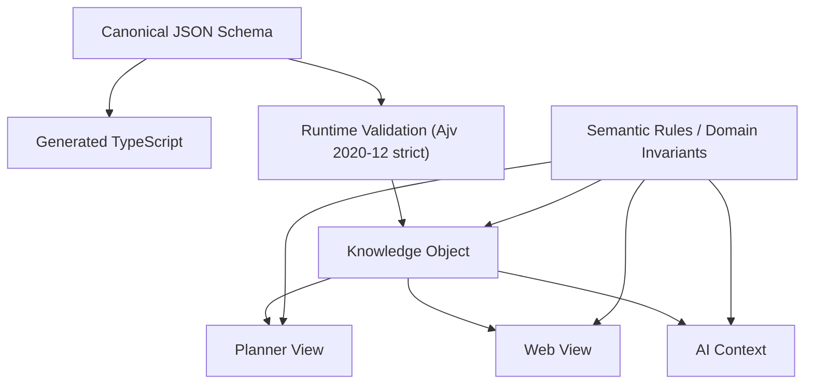

# Knowledge Factory v1.0 Certification

Fecha: 2026-07-18
Estado: Certificacion oficial
Alcance: EPIC-KF-001 a EPIC-KF-004

## 1. Executive Summary

Knowledge Factory nace para convertir el conocimiento fiscal del despacho en un
activo unico, versionado, trazable y reutilizable por varios consumidores sin
duplicacion doctrinal. El problema que resuelve es estructural: antes de este
marco, el conocimiento podia fragmentarse en articulos, guias, respuestas,
checklists, notas internas o logica de producto con criterios no siempre
alineados entre si.

La arquitectura validada establece un contrato canónico neutral en `JSON Schema`,
tipos `TypeScript` generados, reglas semanticas fuera del schema estructural,
politicas explicitas por canal y consumidores derivados que nunca redefinen el
modelo. Esta base ya ha sido verificada con un caso real completo:
`Modelo 210 - Imputacion de rentas inmobiliarias de no residentes`.

Resultado de la validacion: el contrato `v1.0.0` compila en `Ajv Draft 2020-12`
en modo estricto, Planner consume el contrato publicado sin copias manuales, y
las vistas `Planner`, `Web` y `AI` se generan desde un unico objeto fuente sin
requerir cambios estructurales en el modelo.

Respuesta explicita:

> Si. Knowledge Factory puede convertirse en la fuente unica de conocimiento del despacho, dentro del marco de gobierno aqui certificado y manteniendo el contrato `v1.0.0` congelado salvo evidencia excepcional.

## 2. Arquitectura certificada

### 2.1 Knowledge Contract

Knowledge Factory v1.0 queda certificada sobre un contrato neutral con esta
estructura:

- `schema/knowledge-object.schema.json` como fuente canónica unica.
- `generated/knowledge-object.generated.ts` como capa tipada derivada.
- reglas semanticas separadas del schema estructural.
- invariantes de dominio aplicadas en validacion de historia y en consumidores.

### 2.2 Knowledge Object

El modelo validado se apoya en:

- una entidad raiz `KnowledgeObject`;
- bloques internos tipados (`legal_basis`, `technical_development`,
  `procedure`, `checklist`, `faq`, `risk`, `required_documentation`,
  `case_study`, `internal_reference`);
- relaciones explicitas entre objetos o bloques;
- politica de canal por raiz y por bloque;
- metadatos de auditoria, gobierno y versionado.

### 2.3 Consumidores

- `Planner`: consumo operativo interno, con filtrado estricto por canal,
  visibilidad y obsolescencia.
- `Web`: vista derivada publica, sin riesgos internos, referencias internas ni
  contenido restringido.
- `AI`: contexto seguro derivado, con criterio, base legal, procedimiento,
  riesgos y restricciones de autorizacion.

### 2.4 Diagrama de alto nivel



## 3. Evidencia tecnica

### 3.1 Contrato

Evidencia ejecutada:

- compilacion directa del schema canónico con `Ajv 8` en modo `strict`;
- generacion reproducible de tipos desde `schema/knowledge-object.schema.json`;
- comprobacion de sincronizacion `schema -> generated`;
- validacion del ejemplo canónico;
- publicacion del contrato neutral como `@ag/knowledge-contract@1.0.0`.

Repositorios y referencias reales:

- repo neutral: `aperez-hash/ag-knowledge-contract`
- rama de publicacion del contrato: `story/kf-003e-version-knowledge-contract`
- tag: `v1.0.0`

### 3.2 Planner

Evidencia ejecutada:

- consumo del contrato publicado desde `caf-app-interna`;
- validacion runtime directa del schema publicado;
- ausencia de rutas locales y de copias manuales del contrato;
- generacion real de `PlannerKnowledgeView`.

Referencia real:

- rama `story/kf-003-planner-knowledge-consumer`
- commit publicado de consumo: `735b6f2`

### 3.3 Web

Evidencia ejecutada:

- generacion de vista publica derivada desde el mismo `KnowledgeObject`;
- exclusion real de riesgos internos, referencias internas y contenido
  restringido;
- no se introdujeron bloques ni modelos paralelos para la vista web.

### 3.4 IA

Evidencia ejecutada:

- generacion de contexto seguro derivado desde el mismo `KnowledgeObject`;
- inclusion real de criterio, base legal, procedimiento, riesgos y
  restricciones;
- proteccion explicita de `client_response` como `derived_only`.

## 4. Validaciones

| Validacion | Estado |
| --- | --- |
| Schema Validation | PASS |
| Domain Invariants | PASS |
| Rule Engine | PASS |
| Planner View | PASS |
| Web View | PASS |
| AI Context | PASS |
| Tests automatizados | PASS |
| Build del contrato | PASS |
| TypeScript generado sincronizado | PASS |
| Lint / chequeos tecnicos aplicables | PASS |

Base de evidencia ejecutada:

- `Ajv Draft 2020-12 strict`: PASS
- ejemplo canónico: PASS
- `generate-types --check`: PASS
- validacion consolidada `STORY-KF-004A`: PASS
- suite del repo neutral: `19/19` PASS
- `scripts/check.mjs`: PASS
- `git diff --check`: PASS

## 5. Lecciones aprendidas

Hallazgos reales confirmados durante EPIC-KF-001 a EPIC-KF-004:

1. Separar contrato y consumidor fue esencial. Mientras el contrato vivio
   mezclado con un consumidor, la capacidad de certificar integridad fue
   limitada.
2. El repositorio neutral no fue una optimizacion; fue una condicion real para
   trazabilidad, versionado y consumo honesto.
3. Las reglas semanticas y los invariantes de dominio deben vivir fuera del
   schema estructural. El schema solo no cubre gobierno editorial, politicas ni
   restricciones operativas suficientes.
4. Las Gate Reviews evitaron fusionar soluciones aparentemente funcionales pero
   arquitectonicamente incompletas.
5. La deuda de contrato debia cerrarse antes del merge de consumidores. El
   intento de resolver composicion avanzada solo en Planner habria sido un
   error de base.

## 6. Riesgos conocidos

| Riesgo | Nivel | Descripcion |
| --- | --- | --- |
| Crecimiento de taxonomias | Medio | Dominios, topics, subtopics y catálogos pueden crecer de forma desordenada si no se gobiernan centralmente. |
| Gobernanza editorial | Alto | El modelo tecnico esta certificado, pero la calidad futura dependera de revision tecnica y editorial disciplinada por objeto. |
| Mantenimiento de catalogos | Medio | Cualquier deriva manual en etiquetas o codigos degradaria buscabilidad y consistencia entre consumidores. |
| Versionado del conocimiento | Medio | Habra que evitar convivencias ambiguas de objetos vigentes con el mismo `stableKey` y distinto alcance. |
| Congelacion del contrato | Bajo | El `feature freeze` es suficiente si se respeta el proceso; el riesgo aparece solo si se modifican enums o estructura sin PR independiente. |

## 7. Gobierno

Knowledge Factory v1.0 queda gobernada por estas reglas:

1. Todo cambio del contrato requiere PR independiente.
2. Ningun consumidor modifica el contrato.
3. `JSON Schema` es la fuente canónica unica.
4. Los tipos siempre se regeneran desde el schema.
5. Un `KnowledgeObject` nunca redefine el modelo.
6. Ningun objeto puede introducir bloques, enums o taxonomias nuevas por su
   cuenta.
7. Todo nuevo objeto debe validar antes de publicarse.
8. Toda salida a `Planner`, `Web` o `AI` debe derivarse desde el objeto
   canónico, no desde un texto paralelo.
9. Toda excepcion estructural requiere evidencia tecnica y PR propia del
   contrato.

## 8. Criterios para nuevos Knowledge Objects

Todo nuevo objeto debera cumplir, como minimo:

- validacion del schema;
- validacion de invariantes de dominio;
- Rule Engine;
- Planner View;
- Web View;
- AI Context;
- revision tecnica;
- revision editorial.

No podran:

- introducir nuevos bloques;
- modificar el contrato;
- redefinir enums;
- abrir excepciones de canal sin trazabilidad;
- publicar contenido sin respaldo tecnico suficiente cuando el tipo de bloque lo
  requiera.

## 9. Freeze

```text
Knowledge Contract v1.0.0

FEATURE FREEZE
```

Cambios permitidos:

- correccion de errores criticos;
- mejoras de documentacion;
- endurecimiento de validacion sin alterar estructura.

Cambios prohibidos:

- nuevos bloques;
- nuevos enums;
- cambios de estructura;
- modificaciones del contrato sin evidencia tecnica excepcional.

## 10. Roadmap siguiente

Se abre oficialmente:

```text
EPIC-KF-005

Knowledge Production
```

Objetivo:

Construccion sistematica de la biblioteca fiscal sobre la arquitectura ya
certificada, sin reabrir el modelo salvo incidencia estructural real.

Orden inicial recomendado:

1. Modelo 720
2. Regimen de Impatriados
3. Modelo 714
4. Modelo 151
5. Modelo 210 - Arrendamientos
6. Modelo 210 - Ganancias patrimoniales
7. Modelo 216
8. Modelo 296
9. Exit Tax
10. Convenios de doble imposicion

## 11. Estado final

```text
KNOWLEDGE FACTORY v1.0

Architecture ................. CERTIFIED
Knowledge Contract ........... CERTIFIED
Knowledge Object Model ....... CERTIFIED
Planner Integration .......... CERTIFIED
Web View ..................... CERTIFIED
AI Context ................... CERTIFIED

STATUS

KNOWLEDGE FACTORY v1.0 CERTIFIED

READY FOR KNOWLEDGE PRODUCTION
```

Veredicto oficial:

Knowledge Factory v1.0 queda certificada como referencia oficial de gobierno
para el conocimiento estructurado del despacho. El ciclo fundacional se da por
cerrado y el siguiente frente autorizado es exclusivamente `EPIC-KF-005 -
Knowledge Production`.
