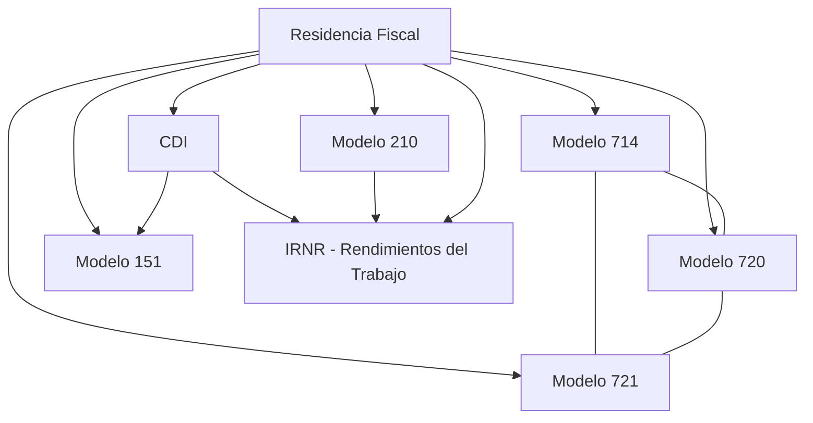

# Knowledge Library v2 Certification

Fecha: 2026-07-18
Estado: Certificacion oficial
Alcance: EPIC-KF-007 - STORY-KF-009

## 1. Resumen ejecutivo

Knowledge Library v2 queda certificada como una biblioteca doctrinal coherente,
reutilizable y estable sobre el contrato `@ag/knowledge-contract@1.0.0`, sin
cambios de arquitectura, sin cambios de contrato y sin deuda tecnica
estructural bloqueante.

La biblioteca certificada incluye ocho `Knowledge Objects` validados de forma
simultanea:

- dos objetos doctrinales transversales;
- cuatro objetos de obligaciones tributarias;
- un objeto de regimen especial;
- un objeto de fiscalidad material.

La validacion conjunta confirma cinco cosas:

1. todos los objetos cumplen el contrato estructural;
2. todas las derivaciones `Planner`, `Web`, `AI`, `Checklist`, `FAQ` y
   `Client Response` son coherentes con la politica de canal vigente;
3. no existe reimplementacion doctrinal material de `Residencia Fiscal` ni de
   `CDI` dentro de los objetos consumidores ya certificados;
4. la plataforma permanece estable bajo `FEATURE FREEZE`;
5. las relaciones entre objetos certificados quedan trazadas sin referencias
   internas rotas tras la correccion editorial de esta historia.

Respuesta oficial:

> Si. Knowledge Library v2 puede considerarse un sistema coherente y estable
> para continuar el tercer ciclo de produccion sin reabrir arquitectura.

## 2. Inventario oficial

| stableKey | Titulo | Version | Estado | Owner | Fecha certificacion | Dependencias doctrinales | Consumidores / expansion principal | Relaciones |
| --- | --- | --- | --- | --- | --- | --- | --- | --- |
| `residencia-fiscal-espana` | Residencia Fiscal en Espana | `1.0.0` | `validado` | `equipo-fiscal-internacional-personas-fisicas` | `2026-07-18T20:51:15.617Z` | Ninguna raiz; base doctrinal transversal | Modelo 210, Modelo 714, Modelo 720, Modelo 721, Modelo 151, IRPF, IRNR, CDI | 8 |
| `convenios-doble-imposicion-cdi` | Convenios para Evitar la Doble Imposicion (CDI) | `1.0.0` | `validado` | `equipo-fiscal-internacional` | `2026-07-18T21:27:35.767Z` | Residencia Fiscal | Modelo 210, Modelo 151, IRPF internacional, IRNR internacional, EP, rentas internacionales | 8 |
| `irnr-modelo-210-imputacion-rentas` | Modelo 210 - Imputacion de rentas inmobiliarias de no residentes | `1.0.0` | `validado` | `equipo-fiscal-no-residentes` | `2026-07-18T12:38:01.549Z` | Ninguna formal | Uso material directo; soporte procedimental para IRNR y Modelo 151 cuando proceda | 0 |
| `modelo-714-impuesto-patrimonio` | Modelo 714 - Impuesto sobre el Patrimonio | `1.0.0` | `validado` | `equipo-fiscal-patrimonio` | `2026-07-18T19:25:32.048Z` | Residencia Fiscal | Relacion con Modelo 720, Modelo 721 e ITSGF | 4 |
| `modelo-720-bienes-derechos-extranjero` | Modelo 720 - Declaracion informativa sobre bienes y derechos situados en el extranjero | `1.0.0` | `validado` | `equipo-fiscal-patrimonio-internacional` | `2026-07-18T17:43:06.916Z` | Residencia Fiscal | Relacion con Modelo 721 y capa convencional de residencia | 3 |
| `modelo-721-monedas-virtuales-extranjero` | Modelo 721 - Declaracion informativa sobre monedas virtuales situadas en el extranjero | `1.0.0` | `validado` | `equipo-fiscal-cripto-internacional` | `2026-07-18T20:14:21.649Z` | Residencia Fiscal | Relacion con Modelo 720, Modelo 714 y futura capa IRPF cripto | 5 |
| `modelo-151-regimen-trabajadores-desplazados` | Modelo 151 - Regimen especial aplicable a los trabajadores, profesionales, emprendedores e inversores desplazados a territorio espanol | `1.0.0` | `validado` | `equipo-fiscal-movilidad-internacional` | `2026-07-18T21:57:05.230Z` | Residencia Fiscal, CDI | IRPF, IRNR y fiscalidad internacional de personas fisicas | 6 |
| `irnr-rendimientos-trabajo` | IRNR - Rendimientos del Trabajo | `1.0.0` | `validado` | `equipo-fiscal-internacional-personas-fisicas` | `2026-07-18T22:53:55.691Z` | Residencia Fiscal, CDI, Modelo 210 | IRNR por otras categorias, IRPF internacional, Modelo 151, teletrabajo internacional | 7 |

## 3. Matriz de dependencias doctrinales

### 3.1 Grafo principal entre objetos certificados



### 3.2 Lectura funcional

- `Residencia Fiscal` actua como objeto doctrinal raiz del segundo ciclo.
- `CDI` depende de `Residencia Fiscal` y extiende la capa doctrinal
  internacional.
- `Modelo 151` consume `Residencia Fiscal` y `CDI`.
- `IRNR - Rendimientos del Trabajo` consume `Residencia Fiscal`, `CDI` y la
  capa procedimental de `Modelo 210`.
- `Modelo 714`, `Modelo 720` y `Modelo 721` se conectan entre si en materia
  patrimonial e informativa sin reabrir doctrina transversal.

### 3.3 Estado de las relaciones

- Relaciones activas entre objetos ya certificados: coherentes tras la
  correccion editorial de STORY-KF-009.
- Relaciones a objetos aun no producidos: se mantienen como referencias de
  roadmap, no como dependencias certificadas de la v2.
- Ciclos innecesarios entre objetos certificados: no detectados.

## 4. Auditoria estructural

Resultado: `PASS`

Verificaciones confirmadas en los ocho objetos:

- `identity`: presente y estable.
- `governance`: version `1.0.0`, estado `validado`, owner definido.
- `classification`: presente y coherente con el dominio del objeto.
- `channelPolicy`: consistente en raiz; mismo patron global de acceso:
  `planner=allowed`, `ia=allowed`, `web/faq/checklist/client_response/tax_library=derived_only`,
  `internal_guide=allowed`.
- `executiveSummary`: presente.
- bloques obligatorios: los ocho objetos contienen exactamente los nueve bloques
  tipados exigidos por el contrato actual.
- `relations`: presentes cuando la historia lo requiere, sin duplicados.
- `auditMetadata`: presente.

Evidencia tecnica:

- `knowledge-object.generated.ts está sincronizado con el schema`
- validacion de ejemplo canónico: `ok: true`
- `tests 89 / pass 89 / fail 0`

## 5. Auditoria de reutilizacion doctrinal

Resultado: `PASS`

### 5.1 Residencia Fiscal

No se detecta reimplementacion material de la doctrina de residencia dentro de:

- `Modelo 151`
- `IRNR - Rendimientos del Trabajo`
- `Modelo 714`
- `Modelo 720`
- `Modelo 721`

Los consumidores la invocan como decision previa o como marco relacionado, sin
duplicar el cuerpo doctrinal transversal.

### 5.2 CDI

No se detecta reimplementacion de la teoria general de convenios dentro de:

- `Modelo 151`
- `IRNR - Rendimientos del Trabajo`

Los objetos consumidores usan `CDI` como capa metodologica, no como doctrina
redefinida.

### 5.3 Fronteras doctrinales

- `Modelo 210` no invade la capa material amplia de IRNR; permanece como objeto
  procedimental concreto sobre imputacion inmobiliaria.
- `IRNR - Rendimientos del Trabajo` consume la capa procedimental de `Modelo 210`
  sin convertirlo en manual general del impuesto.
- `Modelo 151` mantiene su propia logica de regimen especial sin reabsorber
  `Residencia Fiscal` ni `CDI`.

## 6. Auditoria editorial

Resultado: `PASS`

La biblioteca se percibe como un sistema unico por:

- nomenclatura homogénea de bloques, derivaciones e informes;
- uso consistente de tono tecnico-operativo;
- separacion clara entre doctrina transversal, obligaciones, regimenes
  especiales y fiscalidad material;
- estructura repetible de dossier, objeto canónico, artefactos derivados,
  validacion e informe.

Correcciones editoriales justificadas aplicadas en esta historia:

1. alineacion de `targetKnowledgeObjectId` entre objetos ya certificados;
2. normalizacion de dos reglas semanticas que seguian buscando alias antiguos
   para `CDI`;
3. ajuste de redaccion en relaciones de `Residencia Fiscal` y `CDI` para dejar
   de tratar como "futuros" a objetos ya existentes dentro de la propia
   biblioteca.

No se han modificado:

- contrato;
- schema;
- tipos generados;
- Rule Engine estructural;
- arquitectura;
- politica de canal.

## 7. Auditoria funcional

Resultado: `PASS`

Todos los objetos validan simultaneamente en:

- `Schema Validation`
- `Rule Engine`
- `Planner View`
- `Web View`
- `AI Context`
- `Checklist`
- `FAQ`
- `Client Response`

No se detectan contradicciones entre vistas derivadas del mismo objeto.

### Evidencia consolidada

- `scripts/check.mjs`: `PASS`
- suite global: `89/89 PASS`
- incidentes abiertos tras la correccion editorial: `0`

## 8. Cobertura funcional

### 8.1 Cubierto

- `Residencia Fiscal en Espana`
- `Convenios para Evitar la Doble Imposicion (CDI)`
- `Modelo 210`
- `Modelo 714`
- `Modelo 720`
- `Modelo 721`
- `Modelo 151`
- `IRNR - Rendimientos del Trabajo`

### 8.2 Parcial

Ningun objeto en estado intermedio dentro de la biblioteca certificada v2.

### 8.3 Pendiente

Roadmap recomendado para el tercer ciclo:

1. `IRNR - Rendimientos del Capital Inmobiliario`
2. `IRNR - Dividendos, intereses y canones`
3. `IRPF Internacional`
4. `Establecimiento Permanente`
5. `Teletrabajo Internacional`
6. `Fiscalidad de nomadas digitales`

Pendientes adicionales ya insinuados por relaciones de la biblioteca, pero aun
no priorizados formalmente:

- `ITSGF`
- `IRNR otras categorias de renta`
- `IRPF ganancias patrimoniales cripto`
- `Fiscalidad internacional de personas fisicas`

## 9. Versionado y compatibilidad

Resultado: `PASS`

- version del contrato: `@ag/knowledge-contract@1.0.0`
- version de todos los objetos certificados: `1.0.0`
- compatibilidad: uniforme
- historial de certificaciones:
  - `KNOWLEDGE_FACTORY_V1_CERTIFICATION_2026-07-18.md`
  - `KNOWLEDGE_LIBRARY_V2_CERTIFICATION.md`

No se detecta mezcla de versiones de contrato ni de objetos dentro de la
biblioteca certificada.

## 10. Riesgos pendientes

Riesgos residuales no bloqueantes:

1. algunas relaciones apuntan legitima y expresamente a objetos futuros; si no
   se gobiernan, podrian convertirse en referencias obsoletas en ciclos
   posteriores;
2. la cobertura patrimonial e internacional ya es solida, pero la biblioteca
   aun no cubre materias materiales clave como `IRPF Internacional`,
   `Establecimiento Permanente` o `Teletrabajo Internacional`;
3. el patron de relaciones necesita seguir vigilado para que los objetos nuevos
   usen IDs canónicos definitivos desde su primera version.

Ninguno de estos riesgos bloquea la certificacion de la v2.

## 11. Quality Gate

| Control | Estado |
| --- | --- |
| Cero cambios de arquitectura | PASS |
| Cero cambios del contrato | PASS |
| Cero cambios del schema | PASS |
| Relaciones entre objetos certificados consistentes | PASS |
| Biblioteca doctrinal coherente | PASS |
| Deuda tecnica relevante bloqueante | NO |

## 12. Veredicto

```text
KNOWLEDGE LIBRARY V2

Schema Validation ........... PASS
Rule Engine ................. PASS
Planner Views ............... PASS
Web Views ................... PASS
AI Context .................. PASS
Checklist ................... PASS
FAQ ......................... PASS
Client Response ............. PASS
Tests ....................... PASS
Build / Check ............... PASS
Structural Changes .......... NO

STATUS

KNOWLEDGE LIBRARY V2 READY
```
